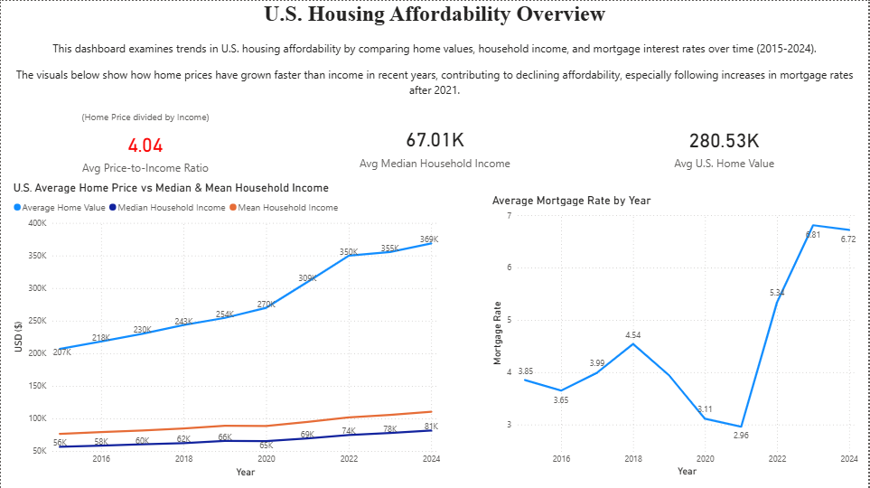
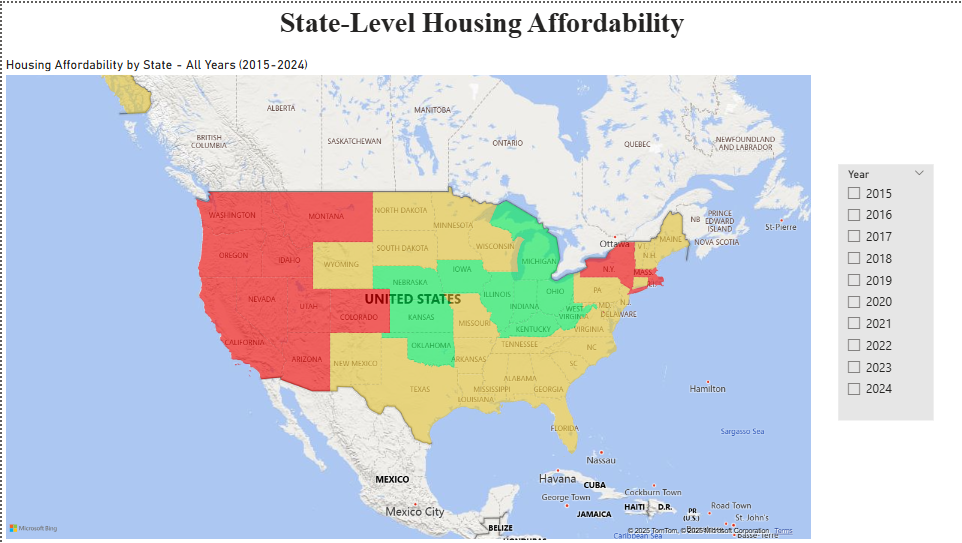
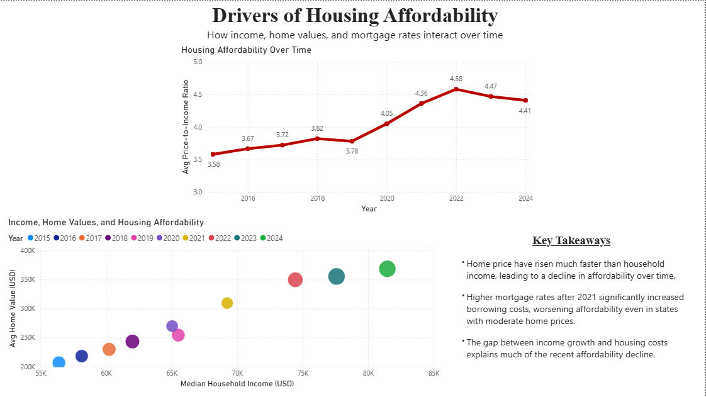
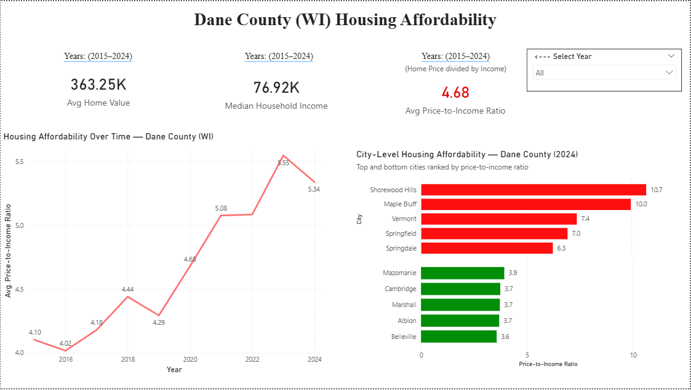
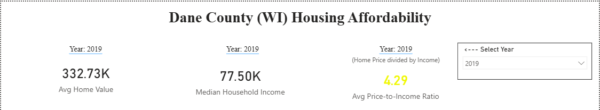
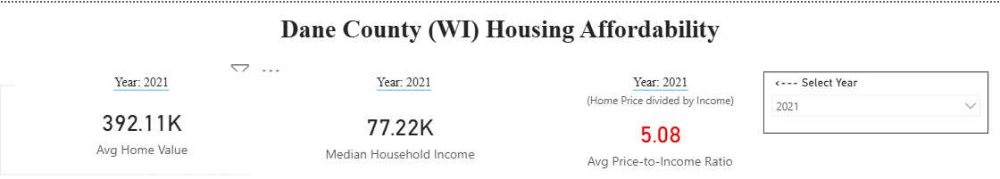

# 📊 Housing Affordability Dashboard

This project analyzes housing affordability trends in the United States, with a focused case study on **Dane County, Wisconsin**. Using home price, income, and mortgage rate data, the dashboard explores how affordability has changed over time and how it varies across regions and cities.

The project emphasizes clean data preparation, clear visualization, and interpretable economic insights.

---

## 🔍 Project Overview

Housing affordability has declined in recent years as home prices have risen faster than household incomes. This dashboard investigates:

- Trends in home prices and income over time  
- Changes in affordability using the price-to-income ratio  
- Geographic variation across U.S. states  
- City-level affordability differences within Dane County  

---

## 📁 Data Sources

- **Zillow Home Value Index (ZHVI)**  
  City- and state-level home value estimates  

- **U.S. Census Bureau (ACS)**  
  Median household income data  

- **FRED (Federal Reserve Economic Data)**  
  Mortgage interest rate data  

Only cleaned and processed datasets are included in this repository.

---

## 📊 Key Metrics

- **Average Home Value**
- **Median Household Income**
- **Price-to-Income Ratio**

**Price-to-Income Ratio Formula:** (Home Price / Median Household Income)

This metric is used as the primary indicator of housing affordability.

---

## 📈 Dashboard Features

### 1. National & State-Level Analysis
- Home price and income trends over time  
- Mortgage rate trends  
- Interactive year filtering  

### 2. Geographic Comparison
- State-level affordability map  
- Dynamic year selection  

### 3. Dane County Case Study
- KPI summary cards  
- Affordability trends over time  
- Top 5 most affordable and least affordable cities  

---

## 🖥 Dashboard Preview

---

## 📌 Key Takeaways

- Housing affordability has declined steadily over the past decade, driven primarily by rapid growth in home prices rather than income growth.
- The price-to-income ratio increased sharply after 2020, reflecting a combination of rising home values and higher mortgage rates.
- Affordability varies significantly by location, even within the same county, highlighting the importance of city-level analysis.
- Dane County mirrors national trends, but certain cities experience substantially higher affordability pressure than others.
- Rising housing costs have outpaced income growth, making homeownership increasingly difficult for median-income households.

## 📌 Dane County Case Study: 2019 vs 2021

To highlight how quickly housing affordability changed, the dashboard compares Dane County metrics before and after the COVID-era housing surge.

### 2019 Snapshot

### 2021 Snapshot

### Key Insight
Between 2019 and 2021, average home prices in Dane County increased by nearly **$60,000**, while median household income **dropped** slightly. This resulted in a sharp increase in the price-to-income ratio, demonstrating how affordability deteriorated rapidly over a short period of time.

---

## 🛠 Tools & Technologies

- Power BI  
- Power Query  
- SQL (data preparation)  
- Excel / CSV   

---

## 📌 Notes

- The dashboard was created using Power BI Desktop.
- Due to publishing restrictions, the interactive dashboard is not publicly hosted.
- Screenshots are provided to demonstrate functionality.
- Cleaned datasets are included for transparency and reproducibility.
